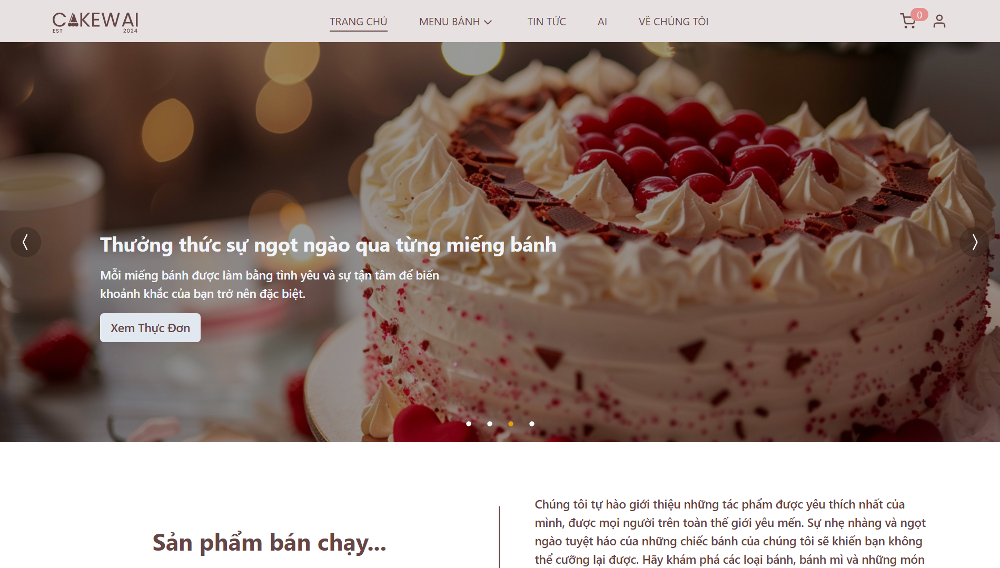

# Frontend for Cakewai Website

## 1. Project Overview

Cakewai is an online bakery website, serving as the final project for the IE104 - Internet and Web Technologies course at the University of Information Technology - VNU-HCM. This project was developed by Group 14, IE104.P11.CNVN class, under the guidance of Dr. Vo Tan Khoa.

## 2. Members

| Student ID | Name |
| --- | --- |
| 22520792 | Nguyen Vo Tien Loc |
| 22520126 | Truong Hoai Bao |
| 22520845 | Tran Gia Man |
| 22520794 | Phan Huu Phuoc Loc |

## 3. Setup Instructions

### Prerequisites

[Node.js](https://nodejs.org/) `20.x` or later.

### Installation

1. Clone this repository:

```bash
git clone https://github.com/hoaibao2k4/Cakewai.git
```

2. Navigate to the project directory:

```bash
cd Cakewai
```

3. Install dependencies:

```bash
npm install
```

### Running the app

```bash
npm start
```

The app should now be running on [http://localhost:5173/](http://localhost:5173/)

## 4. Demo

